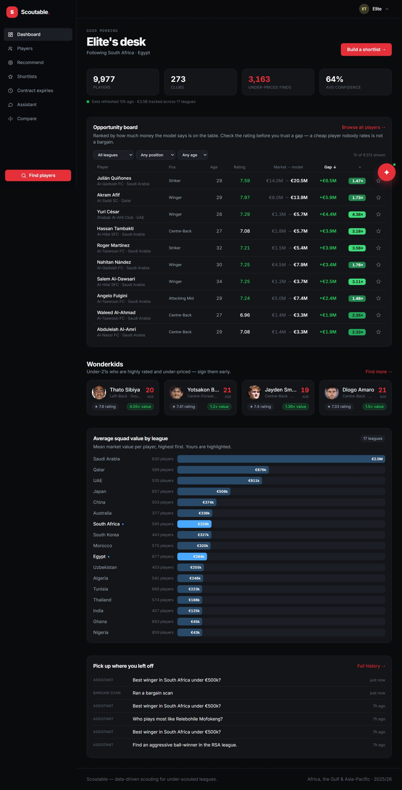
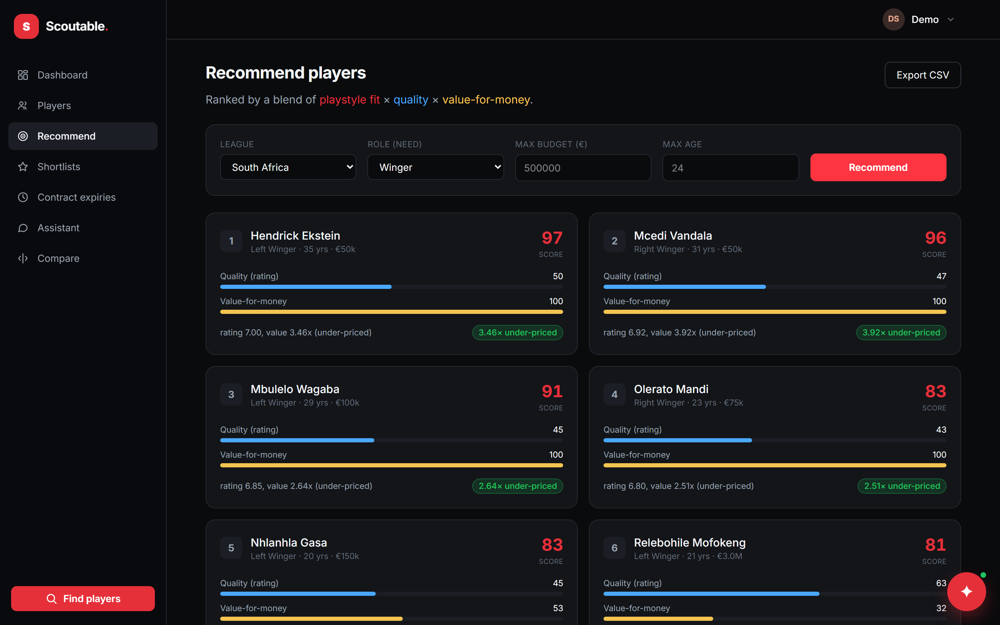
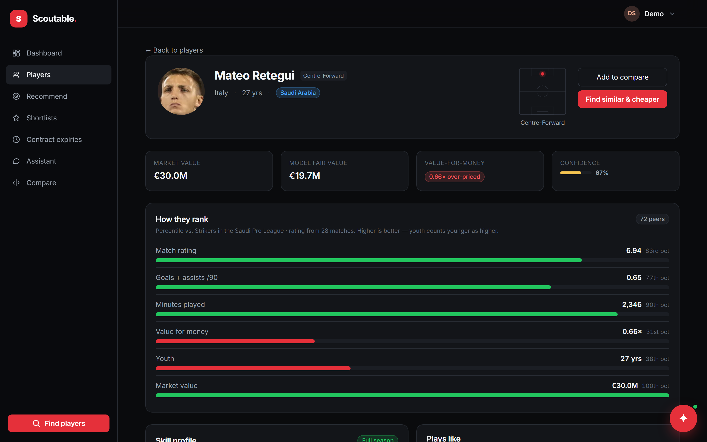
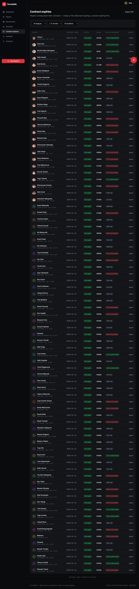
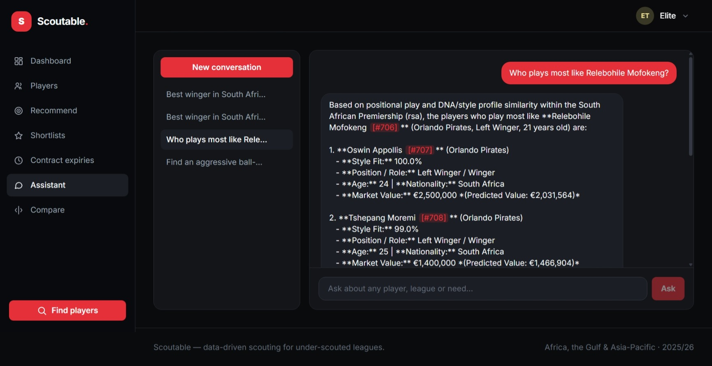

# Scoutable — AI-powered football scouting & talent identification

**Live demo → https://cam-pitch-discovery-extras.trycloudflare.com/**
**Project page → https://eyaazzabi.github.io/scoutable/**



> ### What the model found this morning
>
> **Cristhoper Zambrano**, 22, centre-forward at Al-Taawoun FC in the Saudi Pro League.
> The market prices him at **€250,000**. The model says he is worth **€2.01M** —
> an **8.05× gap**, on a player rated 6.77 across a full season.
>
> He is one of **3,163 players the model currently flags as under-priced** out of 9,977.
> Nobody had to look for him. The system surfaced him.

That is the whole product in one paragraph: an **AI decision-support system for football
recruitment**, aimed at the leagues the industry does not model.

**Why those leagues.** Every European club scouts the Big Five to death, so nothing there
is mispriced for long. Africa, the Gulf and Asia-Pacific are where the talent pipeline
actually starts and where the data is worst — no per-90 stats, no consistent player ids,
no valuation baseline. That absence *is* the opportunity: a club that can price those
players before its rivals can buy a €2M player for €250k. A scouting department is
expensive, slow, and can watch a few hundred players a season. This watches 9,977 and
never stops.

**What it replaces.** The honest alternative is a spreadsheet of scraped stats and a
scout's memory. Filters can tell you who is under 23 and costs less than €500k. They
cannot tell you who *plays like* the winger you just lost, or who is priced below what
they are worth. Both of those are model questions — and they are the two questions
recruitment actually turns on.

## How the AI works

| | |
|---|---|
| **Vector embeddings** | Every player is encoded as a **21-dimension "DNA" vector** and every scouting report as a **384-dimension text embedding**, both stored in **pgvector** behind **HNSW cosine indexes**. Playing style becomes geometry, so "who plays like this player" is a nearest-neighbour query rather than a set of filters. |
| **Gradient-boosted valuation** | An **XGBoost** model predicts what each player *should* cost. The residual against the real market value is an arbitrage signal — it currently flags **3,163 under-priced players**. |
| **A ranking model, not a sort** | Recommendations blend **fit × quality × value** — embedding distance, peer-group percentile and model residual — and expose all three, so the decision stays contestable rather than being handed down as one opaque score. |
| **A grounded RAG agent** | A tool-calling LLM that answers in plain English, **never writes SQL**, routes each question to one of seven retrieval tools, and cites every player by id — with an eval that fails if it cites a player it did not retrieve. |
| **Semantic retrieval** | Reports are embedded **locally** (sentence-transformers MiniLM), so qualitative questions the SQL filters cannot express — *"an aggressive ball-winner who is under-priced"* — are still answerable, at no per-call cost. |
| **Probabilistic entity resolution** | The three sources share **no common player id**. Linking them is blocking on birth year → **RapidFuzz** name scoring → a club crosswalk → a merged golden record carrying a **confidence score**. Everything above depends on this working: without it there is no player to embed. |

The point is the last mile: turning 9,977 rows into a **defensible shortlist**, with the
model's reasoning visible on every card so a human can overrule it.

### How I know it works

Anyone can ship a model. What makes one trustworthy is that **every claim above has a
command that tests it** — measurement lives in the CLI, not in a notebook that ran once.
Real output, South African Premiership:

| Command | Measured |
|---|---|
| `scouting evaluate` | **364 players, k=5. Role purity 100%.** Neighbour rating gap **0.136 vs 0.235** random — DNA neighbours are **42% closer in rating** than chance. Value gap 349k vs 418k. |
| `scouting reco-eval` | **Role purity 100%** across all 8 roles. **Mean quality lift +0.172** over the league average of 6.74, positive for every role. |
| `scouting er-eval` | 470 gold pairs, **precision 1.00 / recall 1.00** — see the caveat below, which matters more than the number. |
| `scouting dq` | 595 players, **0 errors**, 3 warnings: 11.3% lack a birthdate, 10.6% a market value, 45% a height. |
| `scouting chat-eval` | The assistant **only cites players it actually retrieved** (hallucination check) and survives a **prompt-injection** case. |

**The honest reading of that 1.00/1.00.** The gold set is not hand-labelled — it is built
automatically from secondary-source records whose normalised name maps to exactly one
canonical player. So the test proves the fuzzy path *recovers every link the exact path
already gets right*: a real regression guard against the matcher breaking on easy cases,
and **not** evidence of accuracy on the hard ones — transliteration variants, ambiguous
names, missing birth years — which that construction excludes by definition. Measuring
those needs hand-labelling, which is the obvious next piece of work.

**Measurement is what found the one real bug in the ranker.** `reco-eval` originally
reported a mean quality lift of just **+0.066**, and *negative* for strikers and
defensive midfielders — the recommender was returning players slightly worse than league
average while quality carried twice the nominal weight of value. The cause was that the
two components were normalised against fixed ranges of very different usefulness: season
ratings occupy only ~6.2–7.8 of the 5.5–8.5 window the quality scaler assumes, while the
value scaler saturates at 2.0× — extremely common in these leagues. Value therefore had
the **larger effective spread despite the smaller nominal weight**, so the ranker drifted
toward cheap players, which are on average slightly worse ones. Ranking each component
against the actual candidate pool instead makes effective weight equal nominal weight:

| | Before | After |
|---|---|---|
| Mean quality lift | +0.066 | **+0.172** |
| Roles below league average | 2 of 8 | **0 of 8** |
| Role purity | 100% | 100% |

Low-confidence matches are never silently guessed: they go to a **human review queue**
(`scouting review`) with a manual override. A player with no published birthdate stays
`NULL` rather than having one invented.

Built end-to-end during my summer 2026 software-engineering internship at **OPTO Lab**:
data pipeline, entity resolution, embeddings and models, the RAG agent, REST API, React
SPA, accounts/billing, and the containerised production deployment.

> **The source code is private** — it belongs to OPTO Lab. This repository documents the
> system and links to the running deployment.

---

## What is actually running

Numbers pulled live from the deployment's `/api/stats`:

| | |
|---|---|
| **Players** | 9,977 |
| **Clubs** | 273 |
| **Leagues** | 17 |
| **Players flagged under-priced by the model** | 3,163 |
| **Market value under management** | €3.51 B |
| **Mean entity-resolution confidence** | 0.64 |

### Trying it

`/` is a public landing page; everything else needs an account. Sign-up is open — the
deployment runs **billing in demo mode**, so upgrading to a paid tier is instant and no
card is involved. That means the whole product, including the Silver and Gold boards, is
reachable from a fresh sign-up in about a minute.

---

## Features

### Player search & profiles *(free tier)*

- **Full-text + faceted search** across all 17 leagues — filter by country, position,
  age, market value, contract expiry, minutes played.
- **Player profile** with a percentile ranking against a **peer group** (same role, same
  league), a radar chart, career and season history, contract state and market value.
- **Confidence score** on every merged record, so a profile stitched from three sources
  never pretends to be as reliable as one where all three agree.
- **Compare** — overlay up to four players on a single radar.

### Recommendation engine *(Silver)*

`GET /recommend` is the product's centre of gravity. You describe a **need** (role), a
**budget**, and optionally a **playstyle target** (a reference player), and it returns a
ranked list where every entry breaks down into three visible bars:

- **fit** — how close the player's DNA vector is to the profile asked for
- **quality** — percentile performance within their peer group
- **value** — the gap between market price and the model's fair value

The breakdown is deliberately exposed rather than collapsed into a single score: a scout
has to be able to disagree with the model on a specific axis.

Two narrower entry points sit beside it:

- **Hidden gems** — cheaper look-alikes to a named star, capped at a budget.
- **Wonderkids** — young players outperforming their age percentile.



### Player DNA & similarity search *(Silver)*

Every player is reduced to a **21-dimension vector**: 11 numeric features (output, xG,
key passes, aerial duels, tackles, rating, minutes, age, height, and the attacking and
defensive identity of their club) plus 8 position sub-role one-hots. The vector is
z-scored **within its own league**, L2-normalised, and stored in **pgvector** behind an
**HNSW cosine index**.

Similarity search is **role-gated** — a full-back is never returned as similar to a
striker just because their numbers rhyme — and percentile-scaled for readability.

Quality is measured rather than asserted: `scouting evaluate` checks that DNA neighbours
are **~40% closer in rating** than randomly sampled players.



### Fair-value model & bargain board *(Silver)*

An **XGBoost** regressor predicts what a player's market value *should* be, given age,
role, output, league strength and minutes. The **residual** — actual price minus predicted
price — is the arbitrage signal.

The bargain board plots market value against fair value across every league, so the
under-priced players fall visibly below the diagonal. 3,163 players currently sit there.

### Contract-expiry / Bosman radar *(Gold)*

Players whose contracts run out inside a chosen window, ranked by quality — the ones who
can be signed for a fee of zero if you move before somebody else does.



### Shortlists

Named lists with a free-text note per player, so a scout's own judgement lives beside the
model's numbers. Added with a star from any board or profile.

### Conversational assistant (RAG)

A grounded natural-language assistant over the whole database. Two surfaces: a widget on
every signed-in page (quick ask), and a **Gold workspace** at `/assistant` that saves
conversations **together with their tool calls**, so reopening a thread shows what was
consulted, not only what was concluded.

> *"Who is the best winger in South Africa I can sign for under 500k?"*
> *"Who plays like Percy Tau but costs less?"*
> *"Find me an aggressive ball-winner who is under-priced."*

What makes it trustworthy rather than a chat toy:

- **Retrieval tools, not text-to-SQL.** The model never writes SQL. It supplies *values*
  against a typed schema (`country`, `role`, `max_value`, `max_age`, …) that compile to a
  parameterised query with a hard row cap. Seven tools: structured search, the
  recommendation engine, DNA similarity, player profile, a player's notes, semantic note
  search, and league comparison.
- **Routing is the model's tool choice.** "Who plays like X" reaches for DNA similarity;
  "who should we sign under 500k" reaches for the recommender; "who is a ball-winner"
  reaches for semantic note search.
- **Semantic document retrieval.** One scouting report is generated per player from the
  golden record and the DNA vector, written as prose with style descriptors ("an
  aggressive ball-winner", "significantly under-priced") — that phrasing is what makes a
  natural-language query resolvable. Reports are embedded **locally** with
  sentence-transformers MiniLM (384-dim) into pgvector: no API key, no per-call cost, and
  the notes never leave the machine.
- **Grounded generation.** Every player is cited by id (`Ben Motshwari [#412]`), and the
  eval set asserts the assistant only cites players it actually retrieved — an explicit
  hallucination check.
- **Prompt-injection fencing.** Note bodies are third-party free text that lands in the
  model's context, so they are wrapped in `<untrusted_note_text>` with the tag stripped
  from the content — a note cannot close the fence early and escape into instruction
  position. Covered by a dedicated `injection` eval case.
- **Prompt caching.** The system prompt and tool schemas form a frozen, deterministic
  prefix with an ephemeral cache breakpoint, and a unit test asserts that prefix is
  byte-identical across calls, because any drift would silently kill the cache.
- **Redis tool cache.** Results are keyed by tool plus sorted arguments, so a repeated
  question skips the recommendation engine entirely — measured **2,134 ms → 1.3 ms**.
  Errors are never cached, and keys are namespaced so a shape change invalidates them all
  at once.

The assistant is provider-agnostic: it talks to any **OpenAI-compatible endpoint**, so
switching between Gemini, Groq, Mistral, OpenRouter or a local Ollama is a `.env` change
rather than a code change. With no key configured it **disables itself cleanly** and every
other feature keeps working.



*Above: the question routed itself to **DNA similarity search**. The answer is ranked by
cosine distance in the embedding space, reported as a style-fit percentage, and every
player carries the `[#id]` citation that the hallucination eval checks.*

### Accounts, plans & billing

- Sign-up, sign-in, refresh, sign-out, an **active-session list with per-device
  revocation**, password change, and real account deletion.
- A **four-step onboarding wizard** that saves server-side on *every* step, so it resumes
  after a refresh or on a different device. Step 1 branches on role (scout / club / agent
  / analyst) and changes the copy and defaults of the steps after it.
- **Session history** — every search, scan, shortlist and question is recorded and
  replayable from `/history`, grouped by day, and clipped by the plan's retention window.

| Plan | Price | Adds |
|---|---|---|
| **Free** | €0 | Search, profiles & percentiles, compare, 3 shortlists, 20 assistant questions/month, 7 days of history |
| **Silver** | €49/mo | Recommendation engine, bargain board, DNA similarity search, 50 shortlists, 500 questions/month, 12 months of history |
| **Gold** | €149/mo | Contract-expiry board, assistant workspace with saved conversations, CSV export, unlimited shortlists, questions and history |

---

## Architecture

```
                 scrape                    resolve                 analyze                serve
Transfermarkt ─┐                                             ┌─ team style ──┐
FBref ─────────┤─► raw zone ─► normalize ─► entity ─────────►┤─ golden record ┤─► DNA (pgvector) ─► recommend API
Sofascore ─────┘  (SourceRecord)  (Club/Player)  resolution  │  + confidence  │   value model      (fit × quality × value)
                                                             └─ name variants ┘
```

Each source is an **isolated adapter** that first stores its verbatim payload in a **raw
zone** — auditable and replayable, so a parser bug is fixed by re-normalising rather than
re-scraping — and only then normalises into the canonical schema.

| Source | Provides |
|---|---|
| **Transfermarkt** | Squads, bio, **market value**, contracts, height / foot / birthplace |
| **FBref** | Season statistics — appearances, minutes, goals, per-90s |
| **Sofascore** | Match results, per-player **rating**, and real event stats (xG, key passes, aerials, tackles) |
| **golden-\*** | The merged best-of record per player-season, plus an agreement flag |

### Entity resolution

The secondary sources share no identifier with Transfermarkt, so linking them is its own
problem: **birth-year blocking** → **RapidFuzz name scoring** → a **club crosswalk** →
merge into a golden record → score a **confidence** value.

Matches below the threshold go to a **human review queue** (`scouting review`) with a
manual override command, rather than being silently guessed. Precision and recall are
measured against a hand-built gold set (`scouting er-eval`).

Adding a new league is **one entry** in `leagues.py` — the entire pipeline is
parameterised by `--country`.

---

## Tech stack

**Backend** — Python 3.12 · FastAPI · Typer CLI · SQLAlchemy 2 · Pydantic v2 · Alembic

**Data** — PostgreSQL 16 + **pgvector** (HNSW) · Redis · httpx + BeautifulSoup ·
soccerdata · tls_requests · tenacity · RapidFuzz

**ML** — scikit-learn · XGBoost · sentence-transformers · numpy

**Frontend** — React · TypeScript · Vite · Tailwind v4 · TanStack Query · Recharts

**Infrastructure** — Docker Compose · Caddy (automatic TLS) · GitHub Actions

### The CLI is the pipeline

Every stage is a subcommand, so a league can be rebuilt, inspected or repaired without
touching the API:

```bash
scouting scrape            --country rsa   # squads, bio, market values
scouting scrape-sofascore  --country rsa   # matches, ratings, xG
scouting resolve           --country rsa   # entity resolution + review queue
scouting build-golden      --country rsa   # merged records + confidence
scouting build-dna         --country rsa   # 21-dim vectors → pgvector
scouting train-value-model                 # XGBoost fair-value model
scouting score-value       --country rsa   # predicted value + bargains
scouting build-notes       --country rsa   # scouting reports + local embeddings

scouting dq --country rsa                  # data quality: nulls, ranges, duplicates
scouting health                            # per-source freshness, counts, link rates
scouting er-eval / reco-eval / evaluate    # measured quality, not claimed quality
```

---

## Engineering decisions worth calling out

**The paywall has one source of truth.** The feature matrix lives in a single Python
module and is served verbatim by `GET /billing/plans`. The ticks on the pricing page and
the gate the API enforces are literally the same table, so they cannot drift. Adding a
feature is one row; the pricing table, the navigation locks and the API gate all follow.

**Gating returns 402, not 403.** A signed-in user on too small a plan gets a payload
naming the feature and the plan that unlocks it — enough for the UI to render an upgrade
panel where the data would have been, instead of an error. Frontend gating is treated as
UX only; the same feature key is enforced server-side, so editing local state gets you a
402 rather than data.

**Refresh tokens are opaque, stored hashed, and rotated on every use.** A stolen token
works at most once, and the theft surfaces as an unexpected sign-out. `current_user`
re-reads the user row instead of trusting the plan claim in the JWT, so a downgrade or a
ban takes effect immediately rather than at token expiry — for the cost of one
primary-key lookup.

**The sign-in throttle keys on IP, not e-mail.** Keying on the e-mail address would let an
attacker lock a known victim out of their own account.

**Stripe's webhook moves a user between plans — never the redirect back from Checkout.**
The redirect only proves the browser came back; the webhook proves the money settled. With
no Stripe key configured the same endpoints run in demo mode and mark the row
`plan_status="demo"`, so an account upgraded without payment is never mistaken for a
paying customer.

**Player portraits pass three independent checks.** Photos are hot-linked from third-party
CDNs, which means a string scraped out of somebody else's HTML ends up in an ``
in a signed-in user's browser. So the URL is validated on **write** (scraper and
normaliser), on **read** (response-model validator), and in the **browser** (`img-src` CSP
in Caddy) — each layer assuming the others may have failed. The read layer is the one that
matters in practice, and there is a test named for exactly that scenario:
`test_a_hostile_portrait_already_in_the_database_is_never_served`. The rules are an
exact-match host allowlist (not a suffix check — `endswith` would happily accept
`img.transfermarkt.technology.evil.com`), https only, no embedded credentials, no IP
literals, no control characters.

**Secrets are generated on the server and never printed.** `init-env.sh` creates
`JWT_SECRET` and `POSTGRES_PASSWORD` in place at mode 600, and refuses to run if `.env`
already exists — so it cannot rotate a live signing key (which signs every user out) or
the database password (which locks the API out of its own data). A secret that appears in
your terminal ends up in scrollback, in a screen recording, and in somebody else's inbox.

**The image pins `xgboost-cpu` on Linux on purpose.** From XGBoost 3.x the plain wheel
hard-depends on the NVIDIA CUDA runtime (`nvidia-nccl` alone is 252 MB), adding close to a
gigabyte to the image and to every deployment pull — for a model that trains and scores on
CPU.

**Two visual registers, deliberately.** The signed-in app is a card system built for
scanning data. The landing page is editorial — mono micro-labels, hairline rules between
full-bleed sections, a much tighter display type scale — because a marketing page built
out of the app's own cards is what makes a product look templated. Every number on it is
live from the API, so the page cannot claim something the database does not back.

---

## Quality & operations

- **311 backend tests** (`pytest`), with DB-backed tests running inside a rolled-back
  transaction; `ruff` for linting; `alembic check` in CI failing the build on
  model/migration drift; `tsc --noEmit` for the frontend.
- **Measured, not asserted** — entity resolution scored against a gold set, recommendation
  role-purity and quality lift evaluated, DNA neighbour quality quantified, and assistant
  answers checked for citation grounding.
- **A data-quality gate and freshness reporting** built into the CLI, with caveats
  surfaced honestly (a player with no published birthdate stays `NULL` rather than having
  one invented).
- **One-command deployment** — the full stack behind Caddy, which provisions and renews
  its TLS certificate on its own. Only Caddy publishes ports, so **Postgres and Redis are
  unreachable from the internet** regardless of firewall state. Migrations run on API
  start. Nightly `pg_dump` with a 14-day retention.
- **An honest roadmap** kept next to the code rather than in a tracker, listing what is
  done, what is missing, and which trade-offs were deliberate — no e-mail verification
  yet, no frontend tests yet, refresh tokens in `localStorage` as the standard SPA
  compromise.

---

## Context

Summer 2026 software-engineering internship at **OPTO Lab**. Delivered across five
sprints, from the proposal and architecture document through to a deployed product with
accounts and billing.

**Eya Azzabi** · [GitHub](https://github.com/EyaAzzabi)
